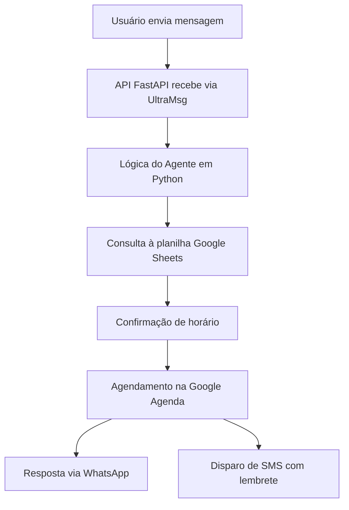

# 🤖 Secretária Inteligente para Profissionais da Saúde

Este projeto apresenta uma **secretária virtual automatizada**, com **IA integrada ao WhatsApp**. Ela realiza agendamentos, envia mensagens automáticas e registra os dados do paciente — tudo sem depender de servidores pagos.

---

## 🚀 O que esta solução faz?

- **Conversa com pacientes** via WhatsApp (e futuramente por SMS)
- **Pergunta o melhor dia e horário** da consulta
- **Verifica a disponibilidade**
- **Oferece alternativas se não houver vaga**
- **Confirma a consulta**
- **Registra os dados em uma planilha (Google Sheets)**
- **Agenda automaticamente no Google Agenda**
- **Envia lembretes automáticos antes da consulta**
- **Cancela a consulta automaticamente caso o paciente não confirme**

---

## ⚙️ Tecnologias Utilizadas

- **FastAPI** – para criar a API
- **ngrok** – para disponibilizar a API local na web
- **Python** – lógica do agente
- **Google Sheets + Google Agenda API** – armazenamento e agendamento
- **UltraMsg (WhatsApp API)** – integração com o WhatsApp
- **AWS EC2 (T2.micro)** – hospedagem gratuita por 12 meses

---

## 🧠 Exemplo de Conversa

```text
Paciente: Oi, queria marcar consulta
Bot: Olá! Qual é o melhor dia e horário para você?
Paciente: Quarta de manhã às 9h
Bot: Um momento! Irei verificar a disponibilidade...

# Se estiver disponível
Bot: Perfeito! Consulta marcada para quarta-feira às 9h. Você receberá uma mensagem de confirmação.

# Se NÃO estiver disponível
Bot: Infelizmente esse horário está ocupado. Para quarta-feira tenho: 10h, 11h ou 14h.
Bot: Nenhum desses horários serve para você? Posso verificar outro dia também.

# Se o paciente recusar todos os horários
Bot: Tudo bem. Qual outro dia e horário seria melhor para você?
# Bot continua procurando até encontrar o horário mais próximo que atenda.

# Após confirmação
Bot: Ótimo! Você receberá um lembrete por WhatsApp e SMS.
```

---

## ☁️ Fluxo do Projeto



---

## ✅ Status Atual

- [x] Projeto iniciado
- [x] Primeira API funcionando na AWS
- [ ] Integração com UltraMsg testada com sucesso
- [ ] Roteiro de conversa estruturado
- [x] Repositório no GitHub: [Rodrigo-RRC/secretaria-inteligente](https://github.com/Rodrigo-RRC/secretaria-inteligente)

---

## 📁 Estrutura do Projeto

```
📦 secretaria-inteligente
├── app/
│   ├── main.py               # FastAPI com rotas
│   ├── agente.py             # Lógica do agente
│   └── agenda.py             # Conexão com Google Sheets e Agenda
├── requirements.txt
├── README.md
└── .env (ou uso direto no Colab)
```

---

## 🔑 Como Rodar

1. **Instalar dependências**
   ```bash
   pip install fastapi uvicorn openai gspread oauth2client
   ```

2. **Rodar a API local**
   ```bash
   uvicorn app.main:app --reload
   ```

3. **Criar túnel com ngrok**
   ```bash
   ngrok http 8000
   ```

4. **Copiar o link HTTPS gerado e colar no UltraMsg**

---

## ⏭️ Próximas Etapas

- Integração com UltraMsg
- Estruturação completa do fluxo de conversa
- Integração com Google Agenda
- Envio automático de SMS e lembretes personalizados
- Confirmação de presença automática
- Cancelamento de consulta por inatividade
- Versão para nutricionistas, dentistas e optometristas

---

## 👨‍💻 Autor

**Rodrigo Ribeiro Carvalho**  
GitHub: [Rodrigo-RRC](https://github.com/Rodrigo-RRC)  
LinkedIn: [linkedin.com/in/rodrigo-ribeiro-datascience](https://linkedin.com/in/rodrigo-ribeiro-datascience)  
WhatsApp: [Clique aqui para conversar](https://wa.me/5547991820339)

---

## ✅ Licença

Este projeto é de uso livre e educacional. A comercialização só é permitida com autorização expressa do autor.

---
